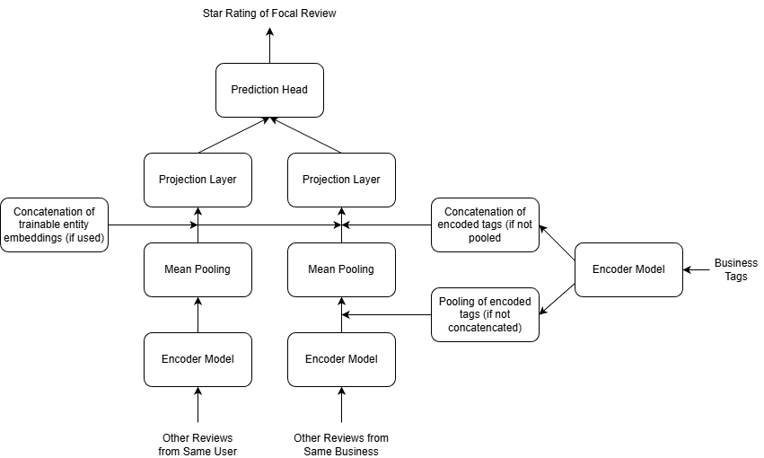

# Two-Tower Yelp Recommender System

A neural recommender system that predicts user ratings for businesses using text embeddings from review corpora. The architecture employs a two-tower approach where user and business representations are learned from pooled review embeddings, then combined through various prediction head strategies to implement content-based filtering.

The system achieves approximately 80% of the RMSE reduction that is seen with a matrix factorization solution relative to an average rating baseline, demonstrating the value of semantic text representations as a substitute for collaborative filtering. Productionization of this system would likely be done with a two stage recommender, using the simpler dot product prediction head model/features as the initial trimming step to a smaller subset while the more complex FFNN based model/features are used for reranking on that subset.

The model architecture diagram is available at the end of this readme.

---

## Overview of Notebooks

### 1. Exploratory Data Analysis

Initial exploration of the Yelp Open Dataset to understand data characteristics and inform preprocessing decisions.

**Key Findings:**

The raw dataset contains approximately 7 million reviews from 2 million unique users. Analysis of review count distributions revealed extreme sparsity—90% of users have 6 or fewer reviews, making cold-start a significant challenge. To create a more tractable learning problem, the dataset was filtered to users with 60+ reviews.

Post-filtering, the star rating distribution concentrates heavily in the 3-5 range with emphasis on 4-star reviews. This concentration, combined with the loss of more polarized reviewers through filtering, suggests the prediction task will be inherently difficult with limited room for improvement over mean-based predictors.

**Data Preparation:**

The notebook trims review records to essential fields (review_id, user_id, business_id, stars, text) and extracts business category tags for use as auxiliary features. Newline characters are normalized to ensure consistent tokenization downstream.

**Data Source:**

The original review data is available at: https://business.yelp.com/data/resources/open-dataset/

---

### 2. Tokenize and Encode Reviews - Word2Vec

Generates 300-dimensional embeddings for each review using the Google News Word2Vec model via Gensim.

**Encoding Strategy:**

For each review, the text is tokenized with NLTK's word_tokenize, lowercased, and filtered to vocabulary tokens. The final embedding is the element-wise mean of all token vectors (word average vector). Reviews with no valid tokens receive zero vectors.

**Optimization:**

Embeddings are rounded to 4 decimal places, reducing storage requirements by over 50% without meaningful loss of precision for downstream tasks.

**Execution:**

Processing runs on a high-RAM CPU-only Colab instance. Reviews and business category tags are processed separately, with execution times of approximately 134 seconds and 29 seconds respectively.

---

### 3. Tokenize and Encode Reviews - Transformers

Generates embeddings using sentence transformers with progressively higher capacity models.

**Models Used:**

| Model | Dimensions | Context Window | Notes |
|-------|------------|----------------|-------|
| SBERT 6-Layer | 384 | 512 tokens | `all-MiniLM-L6-v2` |
| SBERT 12-Layer | 384 | 512 tokens | `all-MiniLM-L12-v2` |
| JINA | 768 | 8192 tokens | `jina-embeddings-v2-base-en` with ALiBi |

**Implementation Details:**

The SentenceTransformer library handles tokenization and encoding. For JINA, which uses ALiBi positional encodings instead of strict positional embeddings, manual padding and mean pooling are implemented to properly handle variable-length inputs.

**Compute Requirements:**

SBERT models run on T4 GPUs. JINA's larger architecture and context window required scaling to A100 GPUs after T4 and L4 instances crashed. For reference, Colab compute costs were approximately 0.22 units/hour (CPU), 1.9 units/hour (L4), and 6.0 units/hour (A100).

---

### 4. Split Data and Generate Features

Creates train/validation/test splits and generates pooled embedding features for the two-tower architecture.

**Splitting Strategy:**

Data is split 80/10/10 by user using deterministic shuffling (seeded by user_id hash). This ensures each user's reviews are distributed proportionally across splits while maintaining reproducibility.

**Feature Generation:**

For each review, two pooled embeddings are computed:
- **User Tower**: Mean of all other reviews by the same user in the same split (excluding the current review)
- **Business Tower**: Mean of all other reviews for the same business in the same split (excluding the current review)

**Feature Variants:**

Two output formats are generated to test different approaches to incorporating business category information:

- **Variant A**: Business category tags are pooled as if they were another review, creating a single `business_pool_with_category` embedding
- **Variant B**: Business category tags are kept as a separate `business_category_embedding` input, concatenated with `business_pool` during training

**Output Format:**

JSON files with fields: review_id, user_id, business_id, split, stars, and the relevant embedding fields. Vectors are rounded to 4 decimal places.

---

### 5. Train Prediction Heads - Regression

Trains various prediction head architectures to map user-business embedding pairs to star ratings.

**Architecture:**

Both towers pass through projection layers before combination. The projection dimension matches the input embedding size initially but can be reduced to control overfitting.

**Prediction Head Strategies:**

| Strategy | Description |
|----------|-------------|
| FFNN | Concatenated projections fed through layers [x, x, x/2, x/4, x/8, x/16, x/32] |
| Dot Product | Normalized projections combined via dot product |

**Training Configuration:**

Low learning rates (5e-7 to 3e-7) with extended epochs (300-400) to clearly observe training dynamics and overfitting behavior. Adam optimizer with optional L2 regularization and dropout.

**Baseline:**

Mean predictor using training set average achieves validation RMSE of 0.9642.

**FFNN Results:**

| Encoder | Variant A (Pooled Tags) | Variant B (Concat Tags) |
|---------|-------------------------|-------------------------|
| Word2Vec (300d) | 0.9481 | 0.9280 |
| SBERT 6-Layer (384d) | 0.9343 | 0.9308 |
| SBERT 12-Layer (384d) | 0.9411 | 0.9193 |
| JINA (768d) | 0.9628 | 0.9447 |

**Dot Product Results:**

| Encoder | Variant A (Pooled Tags) | Variant B (Concat Tags) |
|---------|-------------------------|-------------------------|
| Word2Vec (300d) | — | 0.9239 |
| SBERT 6-Layer (384d) | 0.9355 | 0.9266 |
| SBERT 12-Layer (384d) | 0.9368 | 0.9257 |
| JINA (768d) | 0.9648 | 0.9350 |

**Key Observations:**

- Concatenated category tags (Variant B) consistently yields lower RMSE than pooled tags (Variant A)
- JINA surprisingly underperforms all other encoders despite larger capacity, possibly due to ALiBi positional encodings
- Best FFNN result: SBERT 12-Layer with Variant B achieving **0.9193 validation RMSE**
- Best Dot Product result: Word2Vec with Variant B achieving **0.9239 validation RMSE**
- Minimal practical improvement over baseline mean predictor reflects the concentrated rating distribution

---

### 6. Train Prediction Heads with Entity Embeddings

Extends the best-performing architecture by adding trainable entity ID embeddings.

**Approach:**

Learnable embedding vectors are assigned to each user and business ID, concatenated with the pooled review embeddings before the projection layers. This allows the model to capture entity-specific rating behaviors beyond what's encoded in review text.

**Implementation:**

Entity IDs from the training set are mapped to indices (with index 0 reserved for OOV entities in validation/test). The model architecture was iteratively refined by testing different entity embedding dimensions and prediction head configurations.

**Configuration:**

Uses SBERT 12-Layer with concatenated category tags (Variant B) as the base features.

**Entity Embedding Dimension Experiments (FFNN):**

| Entity Embedding Dim | Validation RMSE |
|---------------------|-----------------|
| 64 | 0.9077 |
| 128 | 0.9008 |
| 256 | 0.8890 |
| 384 | 0.8743 |

**Prediction Head Comparison (384d Entity Embeddings):**

| Strategy | Architecture | Validation RMSE |
|----------|--------------|-----------------|
| Dot Product | proj_dim=1152 | 0.8876 |
| FFNN (small) | hidden=[1152, 144, 18] | 0.8743 |
| FFNN (small) + GELU | hidden=[1152, 144, 18] | 0.8716 |

**1D Entity Embedding Ablation:**

To assess how much improvement comes from simple per-entity bias versus learned semantic interactions:

| Strategy | 1D Entity Embedding RMSE |
|----------|--------------------------|
| Dot Product | 0.9243 |
| FFNN | 0.9157 |

**Best Results:**

- Best FFNN with entity embeddings: **0.8716 validation RMSE** (384d embeddings, GELU activation)
- Best Dot Product with entity embeddings: **0.8876 validation RMSE** (384d embeddings)

This represents a meaningful improvement over the 0.9193 achieved without entity embeddings, demonstrating that per-entity biases capture information not present in text representations alone.

---

### 7. Matrix Factorization Benchmark

Establishes a traditional collaborative filtering baseline for comparison.

**Motivation:**

Literature benchmarks may not transfer directly to this filtered dataset. An "apples to apples" comparison requires training matrix factorization on the exact same splits.

**Methods Tested:**

Basic Matrix Factorization

**Benchmark Result:**

Matrix factorization achieves **0.847 validation RMSE**, establishing the target for the neural approaches to match or exceed.

**Test Set Comparison:**

The text-embedding approach with entity embeddings on the test set (0.876 RMSE) approaches but does not quite beat the matrix factorization baseline (0.856 RMSE). However, the text-based approach offers advantages for cold-start scenarios where new users/businesses have review text but limited interaction history.

---

## Key Takeaways

- **Text embeddings provide meaningful signal** for rating prediction, with transformer-based encoders (SBERT) outperforming Word2Vec
- **Entity embeddings are crucial** for capturing user/business-specific interactions that modify the meaning of review text
- **The rating distribution fundamentally limits performance**—concentration in 3-5 star ratings means even sophisticated models struggle to improve much over mean predictors
- **Matrix factorization remains competitive** for warm-start scenarios, though text approaches offer cold-start advantages
- **Larger models aren't always better**—JINA's 768d embeddings and 8K context window underperformed SBERT's 384d embeddings, suggesting model architecture and tuning matter more than raw capacity for this task
- **Two stage recommender plausible**—with the final configuration using trainable entity embeddings, dot product prediction head is only slightly underperforming FFNN. This favors a two stage recommender with dot product prediction head model used to generate one set of features for quick vector search (through a method like ANN) while the FFNN model and features are used to rerank a trimmed down subset from the first stage. 

## Architecture Diagram

